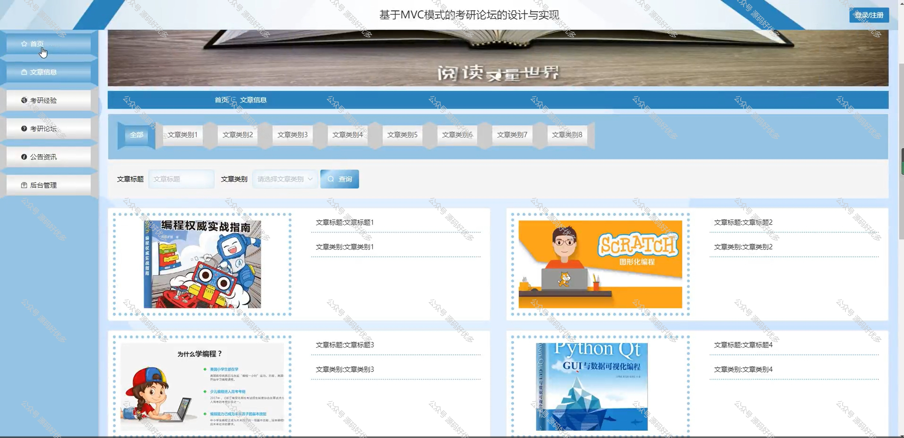

 
## 查看主页获取源码

### 一、作品包含

源码+数据库+全套环境和工具资源+部署教程

### 二、项目技术

前端技术：Html、Css、Js、Vue、Element-ui

数据库：MySQL

后端技术：Java、Spring Boot、MyBatis

  

### 三、运行环境

开发工具：IDEA/eclipse

数据库：MySQL5.7

数据库管理工具：Navicat10以上版本

环境配置软件： JDK1.8+Maven3.6.3

前端Nodejs：14

### 四、项目介绍
项目编号：springbootA310

在当今高等教育日益普及的背景下，考研已成为许多学生继续深造、提升自身竞争力的选择。为了帮助考研学子更好地交流学习经验、共享复习资料和掌握最新的考研动态，考研论坛系统的建立显得尤为重要。该系统旨在为考研人群提供一个信息丰富、互动便捷的网络平台，助力他们顺利达成学业目标。

前台用户功能：首页、文章信息、考研经验、考研论坛、公告资讯、后台管理和个人中心、我的发布、我的收藏。

后台分为管理员和用户
管理员的功能：首页、个人中心、用户管理、文章类别管理、文章信息管理、考研经验管理、意见反馈管理、私信信息管理、分享信息管理、考研论坛、系统管理。
用户的功能：首页、个人中心、考研经验管理、考研经验、意见反馈管理、私信信息管理、分享信息管理。

### 五、运行截图

  
